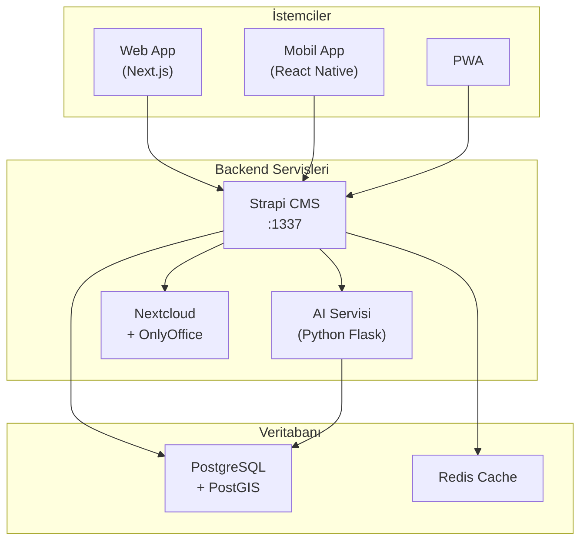
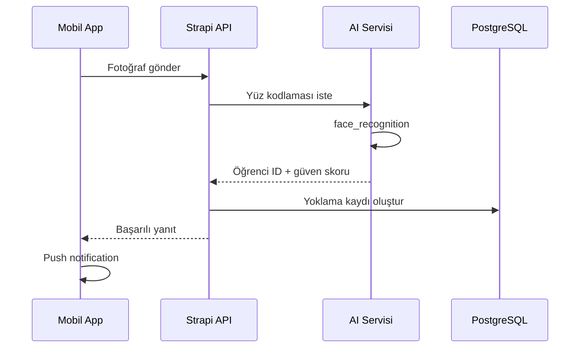
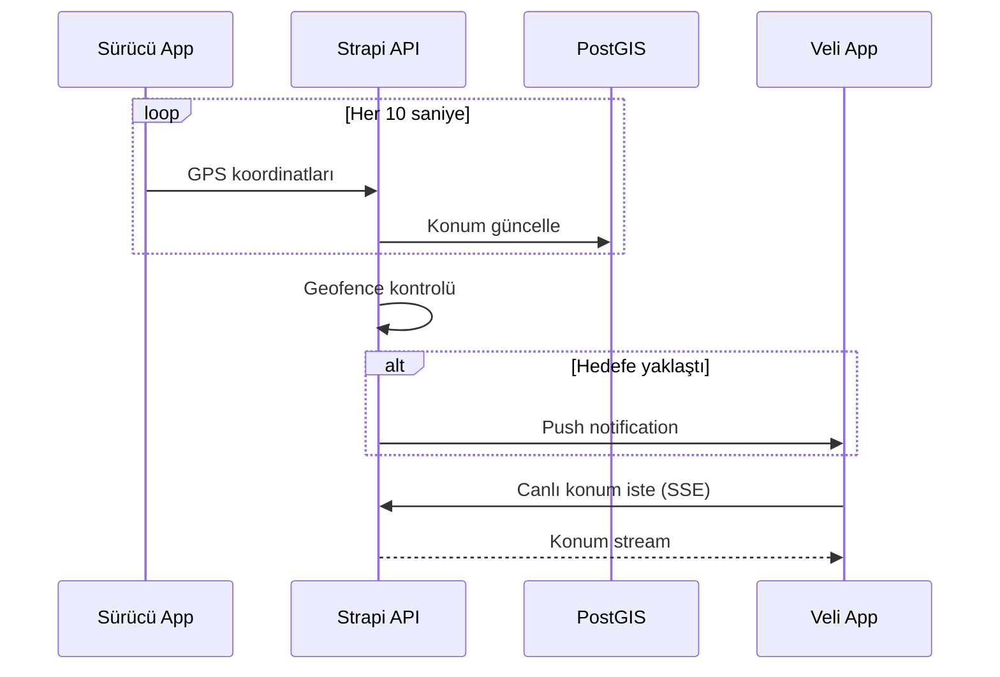
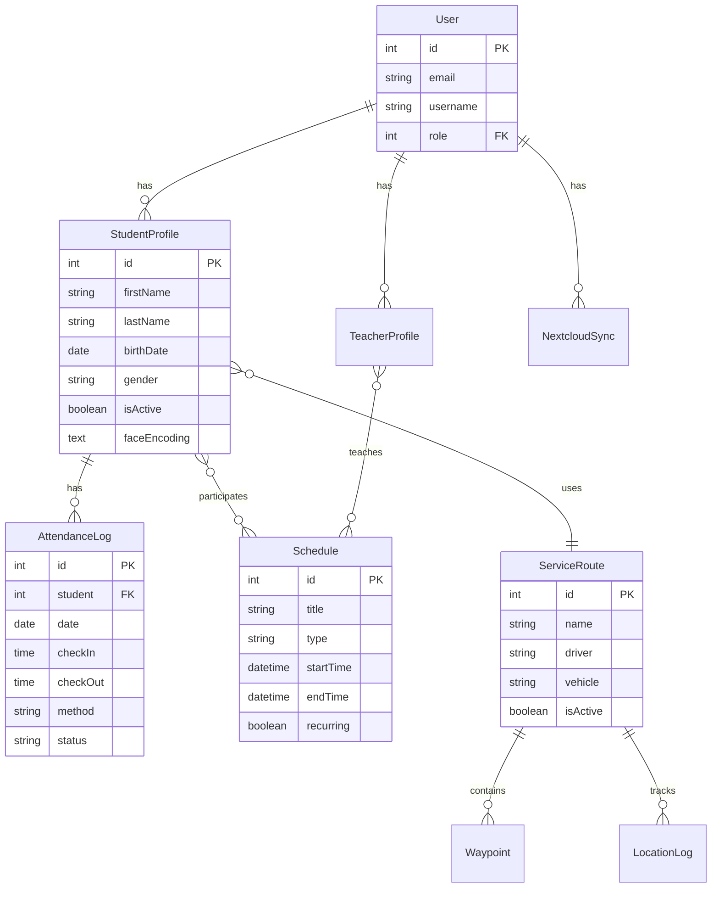
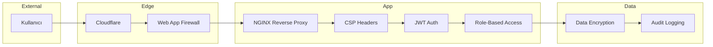
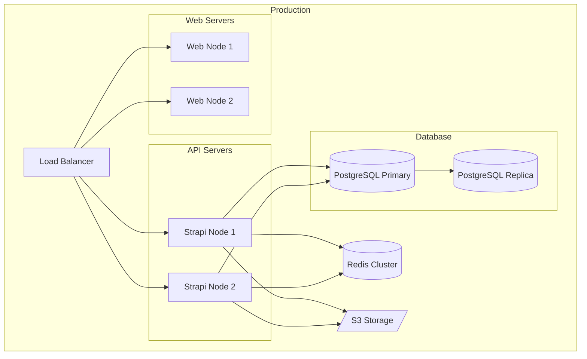
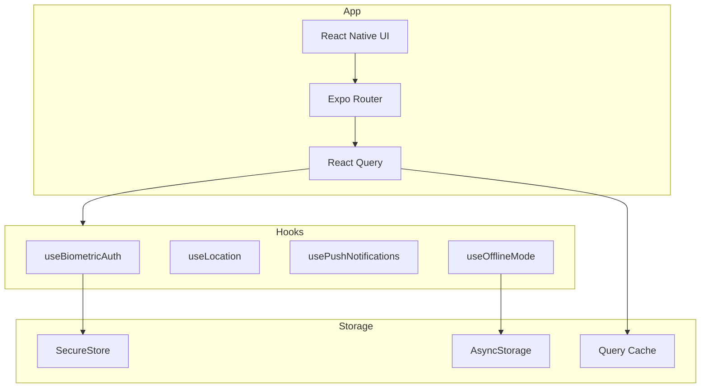
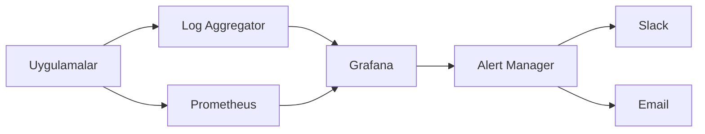

# Sistem Mimarisi

Bu belge, Arkadaş Özel Eğitim ERP sisteminin teknik mimarisini açıklar.

## 🏗️ Genel Bakış

## 📦 Bileşenler

### Frontend

| Bileşen | Teknoloji | Port | Açıklama |
|---------|-----------|------|----------|
| Web | Next.js 15 | 3000 | Admin panel ve veli portalı |
| Mobile | Expo/RN | 8082 | iOS/Android uygulaması |
| PWA | Next.js | 3000 | Progressive Web App |

### Backend

| Bileşen | Teknoloji | Port | Açıklama |
|---------|-----------|------|----------|
| API | Strapi 4 | 1337 | REST/GraphQL API |
| AI | Flask | 5000 | Yüz tanıma servisi |
| Docs | OnlyOffice | 80 | Döküman editörü |
| Files | Nextcloud | 443 | Dosya yönetimi |

## 🔄 Veri Akışı

### Yoklama Süreci

### Servis Takibi

## 🗄️ Veritabanı Şeması

## 🔐 Güvenlik Mimarisi

### Güvenlik Katmanları

1. **Edge**: Cloudflare DDoS koruması, WAF
2. **Transport**: SSL/TLS, HSTS
3. **Application**: CSP, XSS koruması, CSRF token
4. **Authentication**: JWT, 2FA, session timeout
5. **Authorization**: RBAC, policy-based access
6. **Data**: Encryption at rest, audit logging

## 🚀 Deployment Mimarisi

## 📱 Mobil Mimari

## 🔌 Entegrasyonlar

| Sistem | Protokol | Amaç |
|--------|----------|------|
| Nextcloud | WebDAV/OCS | Dosya depolama |
| OnlyOffice | iframe | Döküman düzenleme |
| Google Maps | REST | Harita ve konum |
| Firebase | FCM | Push notifications |
| AI Service | REST | Yüz tanıma |

## 📊 İzleme ve Logging

